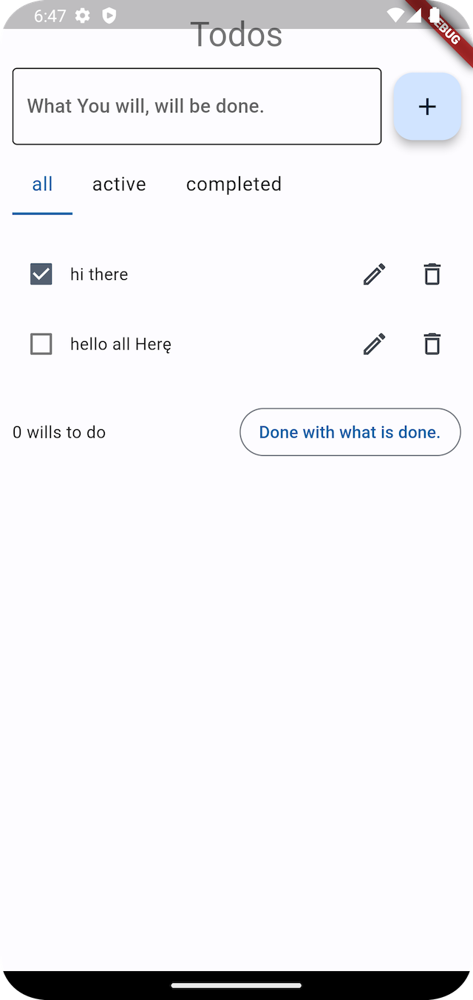
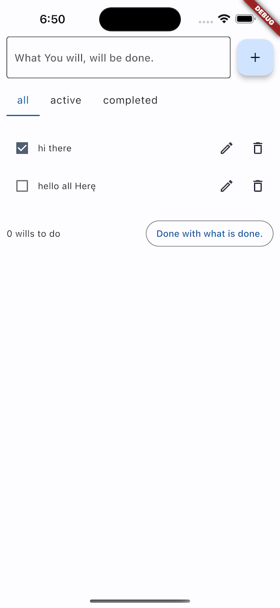

# Just married!!!
# Django and Flutter.

## Rapid developing db based app. Zero boilerplate code.

I hate boilerplate code. I hated it all my life. I made so many steps to remove this mental parasites far from me. And now, with Flet and Django I'm so close to get my ideal. For this moment I made as PoC a clone of a standard Flet ToDo application. All what I change is write all directly inside Django. Flet code is run directly on the backend, so we not need any dedicated communication layer. Next what I'm done is generic data table control. This is a simple control able to create a data table for any Django model. All with searching and sorting.

## Roadmap:
* [x] Create package for a framework
* [x] Create environment for generic Flutter app
  * [x] GenericApp class for a new Flutter application
  * [x] GenericClient class for a new Flutter application instance
  * [x] GenericView class to easily create routed Flutter views
  * [x] Generic middleware class for flexible management of Flutter view routing process
  * [x] UrlsMiddleware class for implementing Django urls based routing
  * [x] Generic navigation mechanism
* [ ] Create authorisation and permissions middleware
  * [ ] AuthApp for apps with authorization
  * [ ] AuthMiddleware for authorisation management
* [ ] Create generic list view for any Django model
  * [x] Generic model's, data table based, control
  * [ ] Generic form based on Django forms
* [ ] Create generic form for any Django model
* [ ] Manage relations between models
* [ ] Documentation!!!

## Instalation
- Install python package:

        $ pip install flet-django
- Add 'flet_django' to INSTALLED_APPS in settings.py:
        `INSTALLED_APPS += ['flet_django']`


## Run and usage

* Let create a Django project:
    ```bash
    pip install Django
    django-admin startproject test_flet_django
    cd test_flet_django
    python manage.py migrate
    ```
* Install flet and flet-django packages:
    ```bash
    pip install flet
    pip install flet-django
    ```
* Add 'flet_django' to INSTALLED_APPS in settings.py:
    ```bash
    echo "INSTALLED_APPS += ['flet_django']" >> test_flet_django/settings.py
    ```
* Create the main function in the file main_app.py at the root of your Django project:
    ```python
    import flet as ft
    from flet_django.pages import GenericApp
    main = GenericApp(controls=[ft.Text("Hello World!")])
    ```
* Run function __main__ from file __main_app.py__ using the Django command:
    ```bash
    python manage.py run_app
    ```
* Enjoy your desktop/mobile/web flutter app.

## View Factory Class

- A framework based on view factories. View Factory is a callable object which takes page as a first argument, and returns instance of ft.View class.
- For simplicity, we can use view factory method of page: `page.get_view`
- Let create a simple flutter view example in file main_app.py:
    ```python
    import flet as ft
    from flet_django.views import ft_view

    def home(page):
        return page.get_view(
            page,
            controls=[ft.Text("Hello World!")],
            app_bar_params=dict(title="ToDo app")
        )
    ```
- Flutter view can be assigned to route by Generic App's urls parameter, or as a target for navigation:
    ```python
    import flet as ft
    from django.urls import path
    from flet_django.pages import GenericApp
    from flet_django.navigation import Destiny

    def home(page):
        return page.get_view(
            page,
            controls=[ft.Text("Hello World!")],
            app_bar_params=dict(title="ToDo app")
        )

    destinations = [
        Destiny(
            route="/",
            icon=ft.icons.HOME,
            selected_icon=ft.icons.HOME_OUTLINED,
            label="home",
            nav_bar=True,
            action=True,
            nav_rail=False
        ),
    ]

    urlpatterns = [
        path('', home, name="home")
    ]

    main = GenericApp(
        destinations=destinations,
        urls=urlpatterns,
        init_route="/"
    )

    ```
- To run application on other devices you need establish server and build client, based on Flutter frontend project from repository
- To run app as server use --view parameter:
    ```bash
    python manage.py run_app --view flet_app_hidden
    ```
- Server will be avaible as http server, for example:
    ```bash
      open http://ala.hipisi.org.pl:8085
    ```
- Compile ./frontend futter app to have separate ready to install application:
    ```bash
      cd frontend
      flutter run --dart-entrypoint-args http://94.23.247.130:8085
    ```
- You can use simple script to run separate flutter application:
    ```bash
      python run.py
    ```

## Demo
You can run repository's project as example of usage.
Working demo [is here](http://ala.hipisi.org.pl:8085).

## Screenshots




